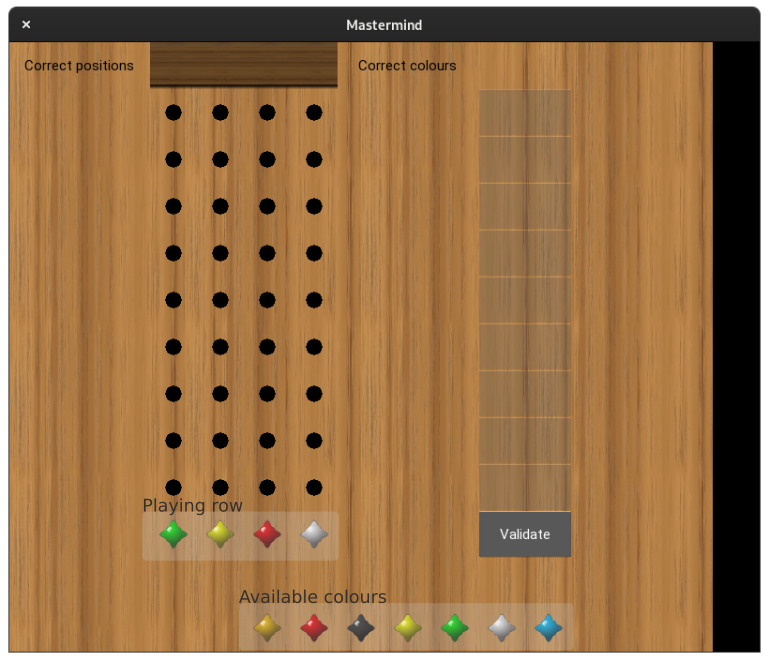
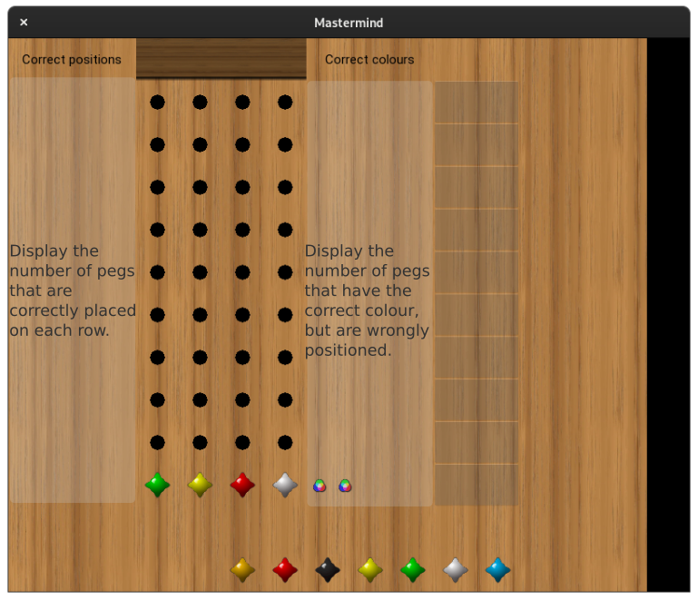
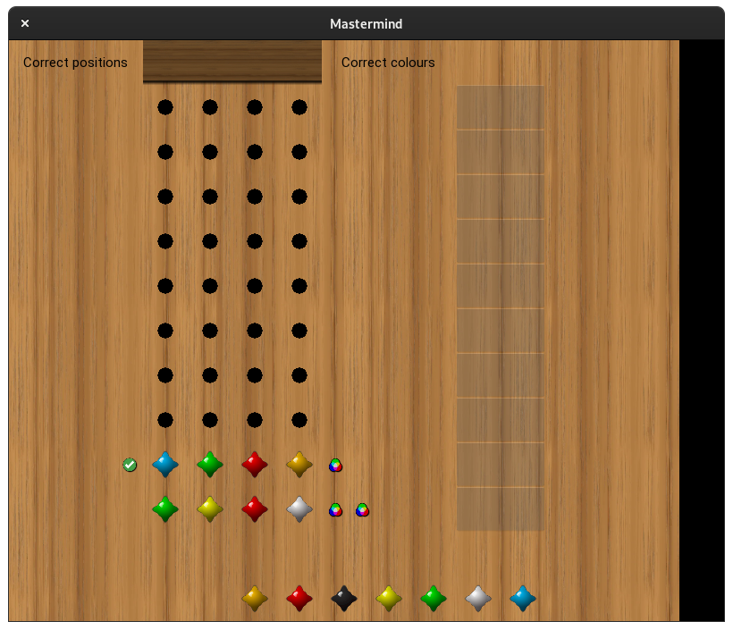
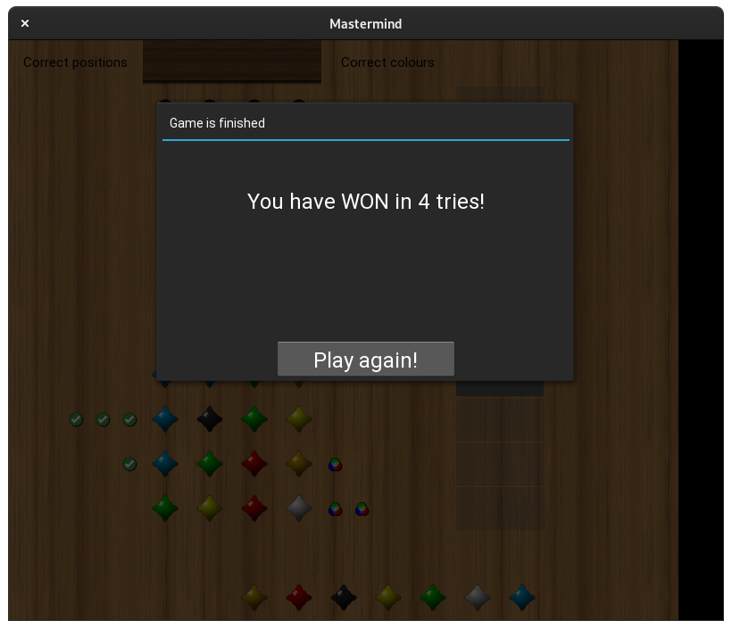
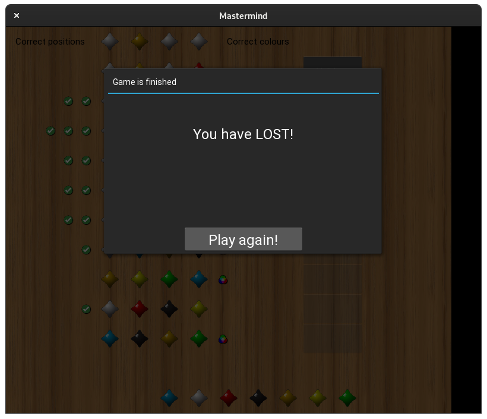

# mastermind

A sample game of Mastermind written in Python.

# Installation

 - Clone the repository,
 - Create a virtualenv using your favourite method.  
   Example:

       python -m venv mastermind_venv
       source mastermind_venv/bin/activate

 - Install the required packages:

       python -m pip install -r requirements.txt

 - Start the application:

       python start.py

# How to play

At application startup, the available colours are display below the board.

 - Among the available colours, the player clicks on a peg of the colour he desires to set on the board,
 - Then clicks on spot of the playing row to set the peg.  
   Note that if the spot has already been set, a new click will changes the colours,
 - When the row is completed, the validate button is unlocked.  
   The player can either validate his guess or change any peg he has already set to another colour.

 - Once the row is validated:
   - The number of correctly positioned peg are displayed on the left of the board with a  symbol,
   - The number of pegs of the correct colour but wrong position are displayed on the right of the board with a  symbol,

The player then continues the game trying to guess the secret code.

Once the correct code has been guessed, the player has won.

If the player fills the board without guesses the secret code, the game is lost.

